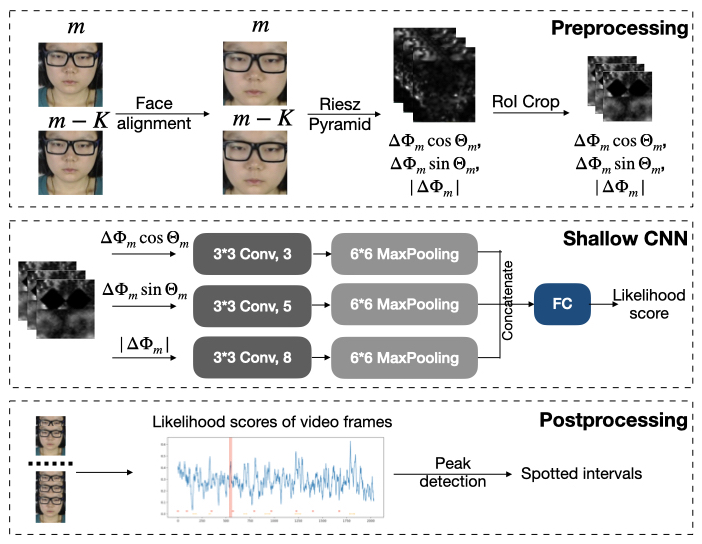
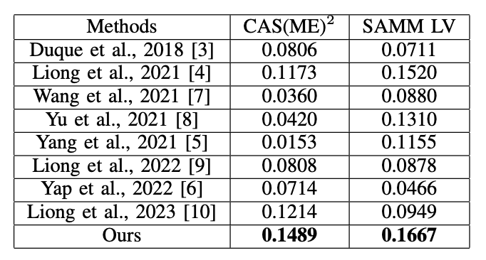

## RMES: Real-Time Micro-Expression Spotting Using Phase From Riesz Pyramid

In this project, we propose RMES, a real-time ME spotting framework. We represent motion using phase computed by Riesz Pyramid, and feed this motion representation into a three- stream shallow CNN, which predicts the likelihood of each frame belonging to an ME. In comparison to optical flow, phase provides more localized motion estimates, which are essential for ME spotting, resulting in higher performance. Using phase also reduces the required computation of the ME spotting pipeline by 77.8%. Despite its relative simplicity and low computational complexity, our framework achieves state-of-the-art performance on two public datasets: CAS(ME)2 and SAMM Long Videos.

Our framework:

F1 score on CASME^2 and SAMM Long:

## Dataset
Download CASME^2 and SAMM Long, and put raw images under ./CASME_sq and ./SAMMLV.

## Preprocessing
### Face Alignment
1. Install Openface: https://github.com/TadasBaltrusaitis/OpenFace 
2. Run preprocess/crop.py

### Extract Phase
1. Install Matlab and Matlab engine for Python
2. Run preprocess/riesz.py

## Training and Testing
Run main.py

## Citation
You can find our paper here: https://arxiv.org/abs/2305.05523 

@article{fang2023rmes,
  title={RMES: Real-Time Micro-Expression Spotting Using Phase From Riesz Pyramid},
  author={Fang, Yini and Deng, Didan and Wu, Liang and Jumelle, Frederic and Shi, Bertram},
  journal={arXiv preprint arXiv:2305.05523},
  year={2023}
}

Contact yfangba@connect.ust.hk if you have any problem.